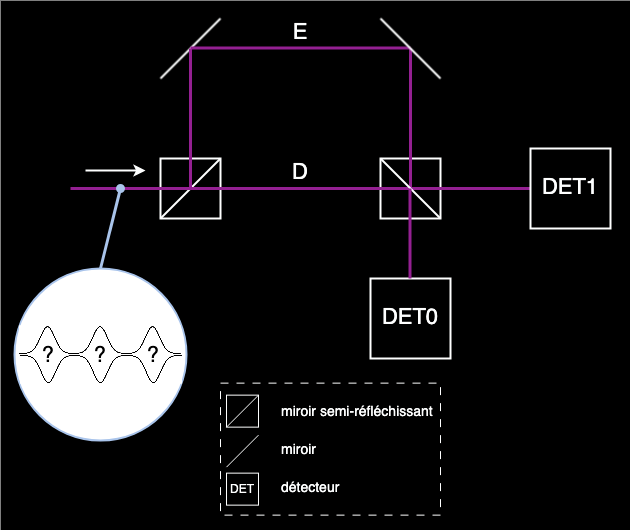
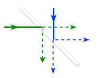

<!-- 
NOTE: Image paths use ../../public/images/ for GitHub/VS Code compatibility.
When integrating with Next.js, these should be changed back to /images/ 
as Next.js serves files from the public directory automatically.
-->

# DPS Protocol Content

## About the Protocol
The Differential Phase Shift (DPS) protocol [[1]](#reference-1) is a quantum protocol for establishing encryption keys.

Unlike the [BB84](bb84.md) and [E91](e91.md) protocols which encode information in the [polarization](definitions.md#polarizations) of [photons](definitions.md#photon), the DPS protocol encodes information in the [phase](definitions.md#phase) of a [pulse train](definitions.md#pulse-train).

The protocol begins with Alice sending single photons into a device comprising three paths: A, B and C

<picture>
  <source srcset="../../public/images/alice_wb_fr.png" media="(prefers-color-scheme: light)">
  <source srcset="../../public/images/alice_bb_fr.png" media="(prefers-color-scheme: dark)">
  
</picture>

In this setup, there is the same length difference between paths A and B as between paths B and C. Thus, a [pulse](definitions.md#pulse) passing through B (or C) is delayed by T compared to a pulse passing through A (or B).

[Beamsplitters](definitions.md#beamsplitter) ensure that the photon has the same probability to take any of the three paths. Once the three paths are recombined, the photon is in a [quantum superposition](definitions.md#quantum-superposition)

$$|\psi_{\text{photon}}\rangle = \frac{1}{\sqrt{3}} (|\psi_A\rangle + |\psi_B\rangle + |\psi_C\rangle),$$

or, equivalently

$$|\psi\rangle = \frac{1}{\sqrt{3}} (|0\rangle + |1\rangle + |2\rangle),$$

with $|0\rangle$ corresponding to the 1st pulse, $|1\rangle$ to the second pulse, and $|2\rangle$ to the last pulse of the train. For each photon sent, Alice randomly chooses 3 bits. If the bit is 1, she applies a [phase shift](definitions.md#phase-shift) of π to the corresponding pulse, and does nothing if the bit is 0. For the three pulses there are 8 possible situations, let's see four examples

<table>
  <thead>
    <tr>
      <th style="text-align: center;">bit 2</th>
      <th style="text-align: center;">bit 1</th>
      <th style="text-align: center;">bit 0</th>
      <th style="text-align: center;">pulse 2</th>
      <th style="text-align: center;">pulse 1</th>
      <th style="text-align: center;">pulse 0</th>
    </tr>
  </thead>
  <tbody>
    <tr>
      <td style="text-align: center;">0</td>
      <td style="text-align: center;">0</td>
      <td style="text-align: center;">0</td>
      <td style="text-align: center;"></td>
      <td style="text-align: center;"></td>
      <td style="text-align: center;"></td>
    </tr>
    <tr>
      <td style="text-align: center;">0</td>
      <td style="text-align: center;">1</td>
      <td style="text-align: center;">0</td>
      <td style="text-align: center;"></td>
      <td style="text-align: center;"></td>
      <td style="text-align: center;"></td>
    </tr>
    <tr>
      <td style="text-align: center;">1</td>
      <td style="text-align: center;">1</td>
      <td style="text-align: center;">0</td>
      <td style="text-align: center;"></td>
      <td style="text-align: center;"></td>
      <td style="text-align: center;"></td>
    </tr>
    <tr>
      <td style="text-align: center;">1</td>
      <td style="text-align: center;">1</td>
      <td style="text-align: center;">1</td>
      <td style="text-align: center;"></td>
      <td style="text-align: center;"></td>
      <td style="text-align: center;"></td>
    </tr>
  </tbody>
</table>

<!-- Todo: images in table are only white, need to combine black and white inside svg info file, and the image will handle the preference directly -->

We note that $(-1)^0 = 1$ and $(-1)^1 = -1$, so we can write the photon state using bits $b_0$, $b_1$ and $b_2$ as follows

$$|\psi_{\text{photon}}\rangle = \frac{1}{\sqrt{3}} ((-1)^{b_0}|0\rangle + (-1)^{b_1}|1\rangle + (-1)^{b_2}|2\rangle).$$

The pulse train is then sent to Bob, whose device (an [interferometer](definitions.md#interferometer)) is as follows

<picture>
  <source srcset="../../public/images/bob_wb_fr.png" media="(prefers-color-scheme: light)">
  <source srcset="../../public/images/bob_bb_fr.png" media="(prefers-color-scheme: dark)">
  
</picture>

Here again, the length difference between paths D and E is such that the pulse train passing through path E is delayed by time T compared to the train passing through D. We can therefore represent the states of the pulse trains at the input of the last semi-reflecting mirror by the states

$$|\psi_D\rangle = \frac{1}{\sqrt{3}} ((-1)^{b_0}|0\rangle + (-1)^{b_1}|1\rangle + (-1)^{b_2}|2\rangle)$$

$$|\psi_E\rangle = \frac{1}{\sqrt{3}} ((-1)^{b_0}|1\rangle + (-1)^{b_1}|2\rangle + (-1)^{b_2}|3\rangle)$$

Let's take an example with bits b0 = 0, b1 = 0 and b2 = 1. We will then have the following states

<table>
  <thead>
    <tr>
      <th style="text-align: center;"></th>
      <th style="text-align: center;">pulse 3</th>
      <th style="text-align: center;">pulse 2</th>
      <th style="text-align: center;">pulse 1</th>
      <th style="text-align: center;">pulse 0</th>
    </tr>
  </thead>
  <tbody>
    <tr>
      <td style="text-align: center;">Path D</td>
      <td style="text-align: center;"></td>
      <td style="text-align: center;"></td>
      <td style="text-align: center;"></td>
      <td style="text-align: center;"></td>
    </tr>
    <tr>
      <td style="text-align: center;">Path E</td>
      <td style="text-align: center;"></td>
      <td style="text-align: center;"></td>
      <td style="text-align: center;"></td>
      <td style="text-align: center;"></td>
    </tr>
  </tbody>
</table>

For two incident rays A and B as illustrated in the following figure,

<picture>
  <source srcset="../../public/images/beamsplitter_wb.png" media="(prefers-color-scheme: light)">
  <source srcset="../../public/images/beamsplitter_bb.png" media="(prefers-color-scheme: dark)">
  
</picture>

we can describe the [unitary operator $U_{bs}$](definitions.md#unitary-operator) associated with the beamsplitter by the transformation

$$U_{bs} |\psi_{in}\rangle = |\psi_{out}\rangle$$

$$\frac{1}{\sqrt{2}} \begin{bmatrix} 1 & 1 \\ 1 & -1 \end{bmatrix} \begin{bmatrix} a \\ b \end{bmatrix} = \begin{bmatrix} c \\ d \end{bmatrix}$$

where $a$, $b$, $c$ and $d$ represent the amplitudes of states $|A\rangle$, $|B\rangle$, $|C\rangle$ and $|D\rangle$ respectively.

Applying this transformation, we get: $c = \frac{a + b}{\sqrt{2}}$ and $d = \frac{a - b}{\sqrt{2}}$.

<!-- Todo: err: in the webpage there is c = a+b and c=a-b; here I put c and d ?? -->

Taking the states $|\psi_D\rangle$ and $|\psi_E\rangle$ described previously, we can calculate the states that result from the interference of the pulses for each time. We obtain the following table:

| Time | D | E | DET0 | DET1 |
|:----:|:-:|:-:|:----:|:----:|
| | $|\psi_{in}\rangle$ | | $|\psi_{out}\rangle$ | |
| T0 | $(-1)^{b_0}$ | 0 | $\frac{1}{\sqrt{2}}(-1)^{b_0}$ | $-\frac{1}{\sqrt{2}}(-1)^{b_0}$ |
| T1 | $\frac{1}{\sqrt{2}}(-1)^{b_1}$ | $\frac{1}{\sqrt{2}}(-1)^{b_0}$ | $\frac{1}{2}((-1)^{b_0} + (-1)^{b_1})$ | $\frac{1}{2}((-1)^{b_0} - (-1)^{b_1})$ |
| T2 | $\frac{1}{\sqrt{2}}(-1)^{b_2}$ | $\frac{1}{\sqrt{2}}(-1)^{b_1}$ | $\frac{1}{2}((-1)^{b_1} + (-1)^{b_2})$ | $\frac{1}{2}((-1)^{b_1} - (-1)^{b_2})$ |
| T3 | 0 | $\frac{1}{\sqrt{2}}(-1)^{b_2}$ | $\frac{1}{\sqrt{2}}(-1)^{b_2}$ | $\frac{1}{\sqrt{2}}(-1)^{b_2}$ |

We note therefore that if a photon is measured at times T0 or T3, it can be detected by detector 0 or detector 1 with a probability of 50% since:

$$\left(\frac{(-1)^{b_0}}{\sqrt{2}}\right)^2 = \left(\frac{-(-1)^{b_0}}{\sqrt{2}}\right)^2 = \left(\frac{(-1)^{b_2}}{\sqrt{2}}\right)^2 = \left(\frac{-(-1)^{b_2}}{\sqrt{2}}\right)^2 = \frac{1}{2}$$

If the photon is measured at times T1 or T2, the values of $b_0$, $b_1$, and $b_2$ determine which detector will be activated. In the DPS protocol, only photons measured at times T1 and T2 are used to establish the key; photons measured at times T0 and T3 are discarded.

Let's take our example with $b_0 = 0$, $b_1 = 0$, $b_2 = 1$. We then have the following probability amplitudes:

$$
\begin{array}{|c|cc|}
\hline
& |\psi_{out}\rangle \\
\hline
\text{Time} & \text{DET0} & \text{DET1} \\
\hline
\text{T1} & 1 & 0 \\
\text{T2} & 0 & -1 \\
\hline
\end{array}
$$

In general, if $b_0 = b_1$ (phase difference of 0) and the photon is detected at time T1, detector 0 is activated and Bob records the bit 0 for his key. Conversely, if $b_0 \neq b_1$ (phase difference of $\pm\pi$) and the photon is detected at time T1, detector 1 is activated and Bob records the bit 1 for his key.

If the photon is instead detected at time T2, then Bob records the bit 0 if $b_1 = b_2$ and the bit 1 otherwise.

Now that we know how Bob can establish the encryption key, he still needs to communicate information to Alice that will allow her to obtain the same key, without the revealed information allowing an external person to deduce this key.

All Bob has to do is to transmit to Alice the detection times of each of the photons. As we have just seen, by knowing the detection time and the value of the bits $b_0$, $b_1$, and $b_2$ (Alice knows these values since she is the one who generated them), Alice can know which detector measured the photon and therefore, Bob's key!

Let's see an example in which Alice received the detection times of 6 photons:

| Photon | $b_2$ | $b_1$ | $b_0$ | Detection time | Key bit |
|:------:|:-----:|:-----:|:-----:|:--------------:|:-------:|
| 1 | 0 | 0 | 1 | T0 | – |
| 2 | 0 | 1 | 1 | T2 | 1 |
| 3 | 0 | 0 | 0 | T1 | 0 |
| 4 | 1 | 0 | 1 | T1 | 1 |
| 5 | 0 | 1 | 1 | T3 | – |
| 6 | 1 | 1 | 0 | T2 | 0 |

Photons 1 and 5 (in gray) are simply discarded because they were detected at times T0 and T3 respectively. Photon 2 was detected at time T2, so it was the pulses modulated by bits b1 and b2 that interfered. Since the phase difference is π between these 2 pulses, Alice records the bit 1 for her key. For photon 3, Bob announced time T1, so it was the pulses modulated by bits b0 and b1 that interfered. Since no phase shift was applied to these pulses, Alice records the bit 0 for her key. You can do the exercise with photons 4 and 6.

## Reference

[1] Inoue K, Waks E, Yamamoto Y. "Differential phase shift quantum key distribution." [*PRL* 89.3 (2002): 037902](https://doi.org/10.1103/PhysRevLett.89.037902).

Here are the English and Spanish translations in markdown:

---

## How to play DPS

The DPS protocol involves two main actors: Alice and Bob, who play different roles. Here you can explore the steps each must follow to successfully carry out the protocol.

### Alice

1. **For each photon to be sent, generate a random sequence of 3 bits** (b₀, b₁, b₂). These bits will be used to encode information as a phase in the pulse train associated with that photon.

2. **Prepare the pulse train**: apply a phase shift of π to pulses where the bit is 1, and leave unchanged those where the bit is 0.

3. **Send the photon** to Bob via your three-path device, which automatically creates the quantum superposition pulse train prepared in step 2.

4. **Wait for Bob’s response**: he will communicate the detection time for each photon (T0, T1, T2, or T3).

5. **Build your key**:
   - Ignore photons detected at T0 and T3.
   - For T1: if b₀ = b₁, the key bit is 0; otherwise, the bit is 1.
   - For T2: if b₁ = b₂, the key bit is 0; otherwise, the bit is 1.

6. **Encrypt and send your message** to Bob using the obtained key.

---

### Bob

1. **Receive each photon** and measure it with your interferometer.

2. **Note the detection time** (T0, T1, T2, or T3) and which detector (DET0 or DET1) was activated.

3. **Publicly communicate** to Alice the detection times for each photon (but keep the detector results secret).

4. **Build your encryption key using only the measurements at times T1 and T2**:
   - DET0 activated = bit 0
   - DET1 activated = bit 1

5. **Decrypt Alice’s message** using your key.
