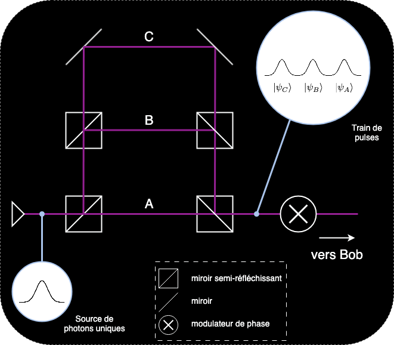

---
title:"protocole DPS"
description: "Guide complet du protocole de distribution quantique de clés DPS"
protocol: "dps"
language: "fr"
version: "1.0"
last_updated: "2025-07-11"
contributors: ["Jean-Fred", "Zubir", "ibra", "..."]
---

<!-- 
NOTE: Image paths use public/images/ for GitHub/VS Code compatibility.
When integrating with Next.js, these should be changed back to /images/ 
as Next.js serves files from the public directory automatically.
-->

# Contenu du protocole DPS

## À propos du protocole
Le protocole à déphasage différentiel [[1]](#reference-1), ou DPS pour Differential phase shift, est un protocole quantique permettant l'établissement de clés de chiffrement.

Contrairement aux protocoles BB84 et E91 qui encodent l'information dans la polarisation des photons, le protocole DPS encode l'information dans les phases d'un train d'impulsions.

Le protocole débute avec Alice qui envoie des photons uniques dans un dispositif comprenant trois trajets: A, B et C

<picture>
  <source srcset="../../public/images/alice_wb_fr.png" media="(prefers-color-scheme: light)">
  <source srcset="../../public/images/alice_bb_fr.png" media="(prefers-color-scheme: dark)">
  
</picture>

Dans ce montage, il y a la même différence de longueur entre les trajets A et B qu'entre les trajets B et C. Ainsi, une impulsion passant par B ( C ) acquiert un retard T par rapport à une impulsion passant par A ( B ).

Des miroirs semi-réfléchissants font en sorte que le photon a la même probabilité de passer par chacun des trois trajets. Une fois les trois trajets recombinés, le photon est dans un état de superposition

$$|\psi_{\text{photon}}\rangle = \frac{1}{\sqrt{3}} (|\psi_A\rangle + |\psi_B\rangle + |\psi_C\rangle),$$

ou, de façon équivalente

$$|\psi\rangle = \frac{1}{\sqrt{3}} (|0\rangle + |1\rangle + |2\rangle),$$

avec $|0\rangle$ qui correspond à la 1ere impulsion, $|1\rangle$ à la seconde impulsion, et $|2\rangle$ à la dernière impulsion du train. Pour chaque photon envoyé, Alice choisit 3 bits de façon aléatoire. Si le bit est 1, elle applique un déphasage de π à l'impulsion correspondante et elle ne fait rien si le bit est 0. Pour les trois impulsions il y a 8 situations possibles, voyons quatre exemples

<table>
  <thead>
    <tr>
      <th style="text-align: center;">bit 2</th>
      <th style="text-align: center;">bit 1</th>
      <th style="text-align: center;">bit 0</th>
      <th style="text-align: center;">impulsion 2</th>
      <th style="text-align: center;">impulsion 1</th>
      <th style="text-align: center;">impulsion 0</th>
    </tr>
  </thead>
  <tbody>
    <tr>
      <td style="text-align: center;">0</td>
      <td style="text-align: center;">0</td>
      <td style="text-align: center;">0</td>
      <td style="text-align: center;"></td>
      <td style="text-align: center;"></td>
      <td style="text-align: center;"></td>
    </tr>
    <tr>
      <td style="text-align: center;">0</td>
      <td style="text-align: center;">1</td>
      <td style="text-align: center;">0</td>
      <td style="text-align: center;"></td>
      <td style="text-align: center;"></td>
      <td style="text-align: center;"></td>
    </tr>
    <tr>
      <td style="text-align: center;">1</td>
      <td style="text-align: center;">1</td>
      <td style="text-align: center;">0</td>
      <td style="text-align: center;"></td>
      <td style="text-align: center;"></td>
      <td style="text-align: center;"></td>
    </tr>
    <tr>
      <td style="text-align: center;">1</td>
      <td style="text-align: center;">1</td>
      <td style="text-align: center;">1</td>
      <td style="text-align: center;"></td>
      <td style="text-align: center;"></td>
      <td style="text-align: center;"></td>
    </tr>
  </tbody>
</table>

<!-- Todo: image in table are only white , need combine black and white inside svg info file, and the image will handle the prefrence directly -->

On remarque que $(-1)^0 = 1$ et $(-1)^1 = -1$, on peut donc écrire l'état du photon à l'aide des bits $b_0$, $b_1$ et $b_2$ de la manière suivante

$$|\psi_{\text{photon}}\rangle = \frac{1}{\sqrt{3}} ((-1)^{b_0}|0\rangle + (-1)^{b_1}|1\rangle + (-1)^{b_2}|2\rangle).$$

Le train d'impulsions est ensuite envoyé à Bob dont le dispositif (un interféromètre) est le suivant

<picture>
  <source srcset="public/images/bob_wb_fr.png" media="(prefers-color-scheme: light)">
  <source srcset="public/images/bob_bb_fr.png" media="(prefers-color-scheme: dark)">
  
</picture>

Ici encore, la différence de longueur entre les trajets D et E est telle que le train d'impulsions passant par le trajet E est retardé d'un temps T par rapport au train passant par D. On peut donc représenter les états des trains d'impulsions en entrée du dernier miroir semi-réfléchissant par les états

$$|\psi_D\rangle = \frac{1}{\sqrt{3}} ((-1)^{b_0}|0\rangle + (-1)^{b_1}|1\rangle + (-1)^{b_2}|2\rangle)$$

$$|\psi_E\rangle = \frac{1}{\sqrt{3}} ((-1)^{b_0}|1\rangle + (-1)^{b_1}|2\rangle + (-1)^{b_2}|3\rangle)$$

Prenons un exemple avec les bits b0 = 0, b1 = 0 et b2 = 1. On aura alors les états suivants

<table>
  <thead>
    <tr>
      <th style="text-align: center;"></th>
      <th style="text-align: center;">impulsion 3</th>
      <th style="text-align: center;">impulsion 2</th>
      <th style="text-align: center;">impulsion 1</th>
      <th style="text-align: center;">impulsion 0</th>
    </tr>
  </thead>
  <tbody>
    <tr>
      <td style="text-align: center;">Trajet D</td>
      <td style="text-align: center;"></td>
      <td style="text-align: center;"></td>
      <td style="text-align: center;"></td>
      <td style="text-align: center;"></td>
    </tr>
    <tr>
      <td style="text-align: center;">Trajet E</td>
      <td style="text-align: center;"></td>
      <td style="text-align: center;"></td>
      <td style="text-align: center;"></td>
      <td style="text-align: center;"></td>
    </tr>
  </tbody>
</table>

Pour deux rayons incidents A et B comme illustré sur la figure suivante,

<picture>
  <source srcset="public/images/beamsplitter_wb.png" media="(prefers-color-scheme: light)">
  <source srcset="public/images/beamsplitter_bb.png" media="(prefers-color-scheme: dark)">
  
</picture>

on peut décrire l'opérateur $U_{bs}$ associé au miroir semi-réfléchissant par la transformation

$$U_{bs} |\psi_{in}\rangle = |\psi_{out}\rangle$$

$$\frac{1}{\sqrt{2}} \begin{bmatrix} 1 & 1 \\ 1 & -1 \end{bmatrix} \begin{bmatrix} a \\ b \end{bmatrix} = \begin{bmatrix} c \\ d \end{bmatrix}$$

où $a$, $b$, $c$ et $d$ représentent les amplitudes des états $|A\rangle$, $|B\rangle$, $|C\rangle$ et $|D\rangle$ respectivement.

En appliquant cette transformation, on obtient : $c = \frac{a + b}{\sqrt{2}}$ et $d = \frac{a - b}{\sqrt{2}}$.

<!-- Todo: err: dans le webpage il y c = a+b et c=a-b; moi ici j'ai met c et d ?? -->

En prenant les états $|\psi_D\rangle$ et $|\psi_E\rangle$ décrits précédemment, on peut donc calculer les états qui résultent de l'interférence des impulsions pour chaque temps, nous obtenons le tableau suivant :

| Temps | D | E | DET0 | DET1 |
|:-----:|:-:|:-:|:----:|:----:|
| | $|\psi_{in}\rangle$ | | $|\psi_{out}\rangle$ | |
| T0 | $(-1)^{b_0}$ | 0 | $\frac{1}{\sqrt{2}}(-1)^{b_0}$ | $-\frac{1}{\sqrt{2}}(-1)^{b_0}$ |
| T1 | $\frac{1}{\sqrt{2}}(-1)^{b_1}$ | $\frac{1}{\sqrt{2}}(-1)^{b_0}$ | $\frac{1}{2}((-1)^{b_0} + (-1)^{b_1})$ | $\frac{1}{2}((-1)^{b_0} - (-1)^{b_1})$ |
| T2 | $\frac{1}{\sqrt{2}}(-1)^{b_2}$ | $\frac{1}{\sqrt{2}}(-1)^{b_1}$ | $\frac{1}{2}((-1)^{b_1} + (-1)^{b_2})$ | $\frac{1}{2}((-1)^{b_1} - (-1)^{b_2})$ |
| T3 | 0 | $\frac{1}{\sqrt{2}}(-1)^{b_2}$ | $\frac{1}{\sqrt{2}}(-1)^{b_2}$ | $\frac{1}{\sqrt{2}}(-1)^{b_2}$ |

On remarque donc que si un photon est mesuré aux temps T0 ou T3, il peut être détecté par le détecteur 0 ou le détecteur 1 avec une probabilité de 50% puisque:

$$\left(\frac{(-1)^{b_0}}{\sqrt{2}}\right)^2 = \left(\frac{-(-1)^{b_0}}{\sqrt{2}}\right)^2 = \left(\frac{(-1)^{b_2}}{\sqrt{2}}\right)^2 = \left(\frac{-(-1)^{b_2}}{\sqrt{2}}\right)^2 = \frac{1}{2}$$

Si le photon est mesuré aux temps T1 ou T2 , les valeurs de $b_0$, $b_1$ et $b_2$ déterminent le détecteur qui sera activé. Dans le protocole DPS, seuls les photons mesurés aux temps T1 et T2 sont utilisés pour établir la clé, les photons mesurés aux temps T0 et T3 sont rejetés.

Reprenons notre exemple avec $b_0 = 0$, $b_1 = 0$, $b_2 = 1$. On a alors les amplitudes de probabilité suivantes :

$$
\begin{array}{|c|cc|}
\hline
& |\psi_{out}\rangle \\
\hline
\text{Temps} & \text{DET0} & \text{DET1} \\
\hline
\text{T1} & 1 & 0 \\
\text{T2} & 0 & -1 \\
\hline
\end{array}
$$

De façon générale si $b_0 = b_1$, (différence de phase de 0) et que le photon est détecté au temps T1, le détecteur 0 est activé et Bob enregistre le bit 0 pour sa clé.  À l'inverse, si $b_0 \neq b_1$ (différence de phase de $\pm\pi$) et que le photon est détecté au temps T1 , le détecteur 1 est activé et Bob enregistre le bit 1 pour sa clé.

Si le photon est plutôt détecté au temps T2 , alors Bob enregistre le bit 0 si $b_1 = b_2$ et le bit 1 dans le cas contraire.

Maintenant qu'on sait comment Bob peut établir la clé de chiffrement, il lui reste à communiquer à Alice de l'information qui permettra à cette dernière d'obtenir la même clé, sans toutefois que l'information révélée permette à une personne externe de déduire cette clé.

Tout ce que Bob a à faire, c'est de transmettre à Alice les temps de détection de chacun des photons. Comme on vient de le voir, en connaissant le temps de détection et la valeur des bits $b_0$, $b_1$ et $b_2$ (Alice connait ces valeurs puisque c'est elle qui les a générées), Alice peut savoir quel détecteur a mesuré le photon et donc, la clé de Bob!

Voyons un exemple dans lequel Alice a reçu les temps de détection de 6 photons :

| Photon | $b_2$ | $b_1$ | $b_0$ | Temps de détection | Bit de clé |
|:------:|:-----:|:-----:|:-----:|:------------------:|:----------:|
| 1 | 0 | 0 | 1 | T0 | – |
| 2 | 0 | 1 | 1 | T2 | 1 |
| 3 | 0 | 0 | 0 | T1 | 0 |
| 4 | 1 | 0 | 1 | T1 | 1 |
| 5 | 0 | 1 | 1 | T3 | – |
| 6 | 1 | 1 | 0 | T2 | 0 |

Les photons 1 et 5 (en gris) sont simplement rejetés car ils ont été détectés aux temps T0 et T3 respectivement. Le photon 2 a été détecté au temps T2, ce sont donc les impulsions modulées par les bits, b1 et b2 qui ont interférées. Puisque la différence de phase est de π entre ces 2 impulsions, Alice enregistre le bit 1 pour sa clé. Pour le photon 3, Bob a annoncé le temps T1, ce sont donc les impulsions modulées par les bits b0 et b1 qui ont interférées. Puisqu'aucun déphasage a été appliqué à ces impulsions, Alice enregistre le bit 0 pour sa clé. Vous pouvez faire l'exercice avec les photons 4 et 6.

## Référence

[1] Inoue K, Waks E, Yamamoto Y. "Differential phase shift quantum key distribution." [*PRL* 89.3 (2002): 037902](https://doi.org/10.1103/PhysRevLett.89.037902).

## Comment jouer à DPS

...

### Alice
...

### Bob
...