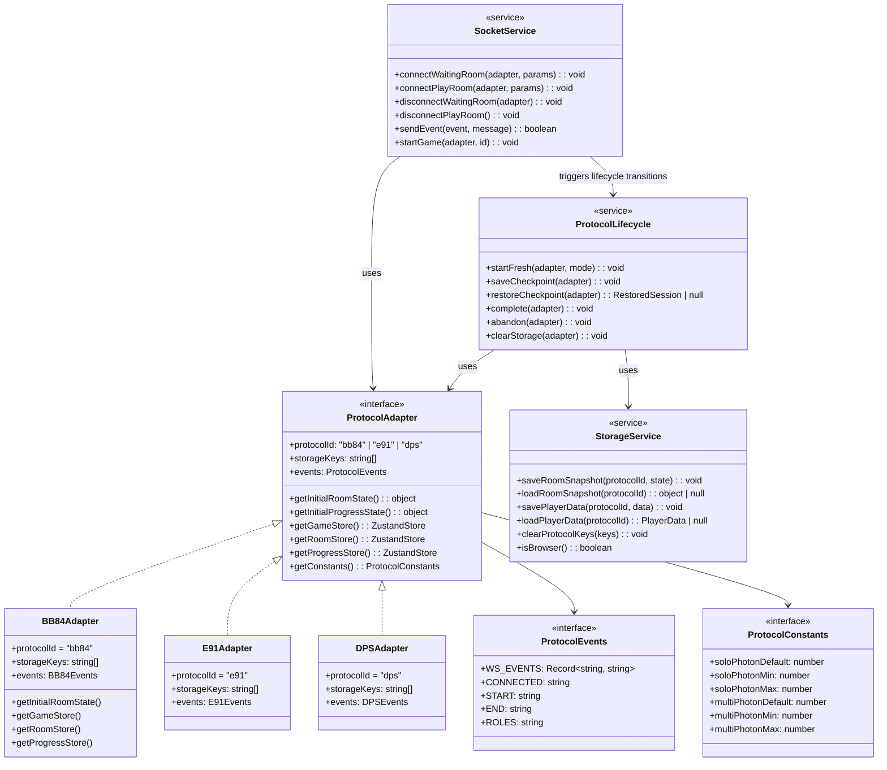
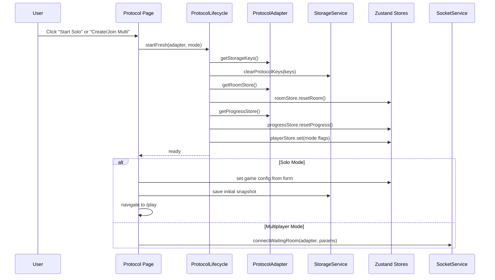
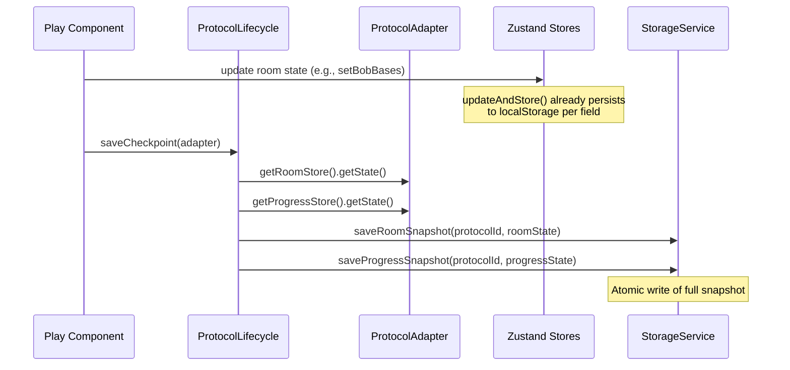
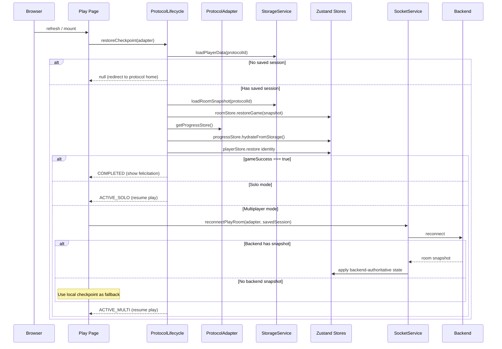
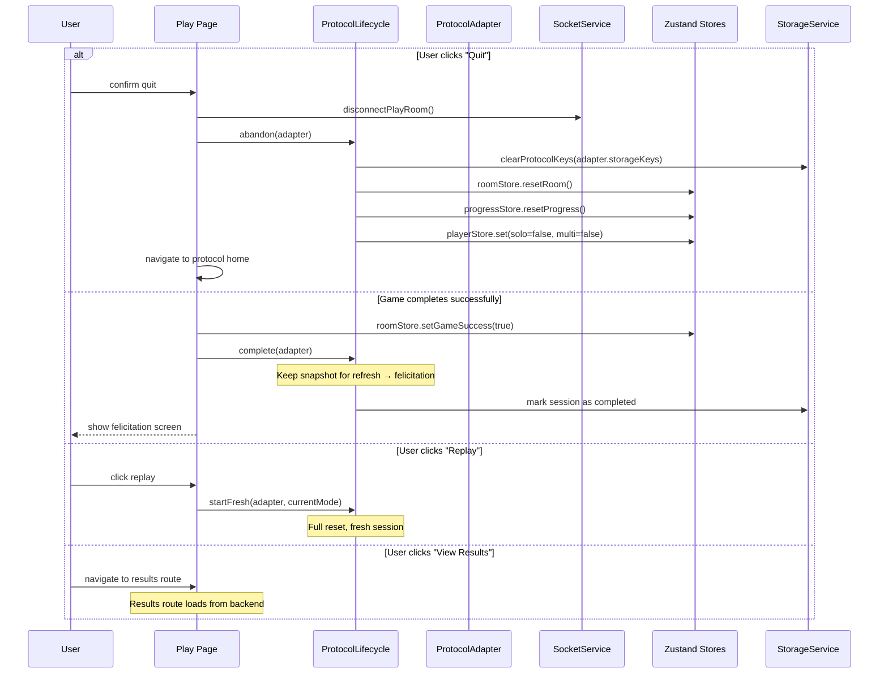

# 🏗️ QuantumCrypto Architecture: Deep Analysis & Investigation

> **Role**: Deep codebase audit and architectural investigation  
> **Date**: June 2026  
> **Led to**: [shared-protocol-lifecycle-adr.md](shared-protocol-lifecycle-adr.md) (the draft architecture plan)
>
> This document records the full investigation: every file read, redundancy
> measurements, OOP vs functional analysis, and the initial architecture proposal.
> The ADR refines the proposal with corrections from a 3-way review discussion
> (see [architecture-discussion-log.md](architecture-discussion-log.md)).

---

## 1. What I Read (Everything)

I studied every file relevant to the architecture question:

| Layer | Files Read |
|-------|------------|
| **Stores** | All 10 store files: 3× `room-store`, 3× `progress-store`, 3× `game-store`, 1× `player-store` |
| **Lib/Logic** | [bb84/solo-player.ts](file:///Users/chei2402/Documents/github/algolab-quantique/quantumcrypto-frontend/lib/bb84/solo-player.ts), [bb84/utils.ts](file:///Users/chei2402/Documents/github/algolab-quantique/quantumcrypto-frontend/lib/bb84/utils.ts), [e91/solo-player.ts](file:///Users/chei2402/Documents/github/algolab-quantique/quantumcrypto-frontend/lib/e91/solo-player.ts), [e91/utils.ts](file:///Users/chei2402/Documents/github/algolab-quantique/quantumcrypto-frontend/lib/e91/utils.ts), [dps/dps-protocol.ts](file:///Users/chei2402/Documents/github/algolab-quantique/quantumcrypto-frontend/lib/dps/dps-protocol.ts), [dps/utils.ts](file:///Users/chei2402/Documents/github/algolab-quantique/quantumcrypto-frontend/lib/dps/utils.ts), [utils.ts](file:///Users/chei2402/Documents/github/algolab-quantique/quantumcrypto-frontend/lib/utils.ts) |
| **Socket** | [socket-provider.tsx](file:///Users/chei2402/Documents/github/algolab-quantique/quantumcrypto-frontend/components/providers/socket-provider.tsx) — 1556 lines, the biggest file |
| **Constants** | [bb84-constants.ts](file:///Users/chei2402/Documents/github/algolab-quantique/quantumcrypto-frontend/bb84-constants.ts), [e91-constants.ts](file:///Users/chei2402/Documents/github/algolab-quantique/quantumcrypto-frontend/e91-constants.ts), [dps-constants.ts](file:///Users/chei2402/Documents/github/algolab-quantique/quantumcrypto-frontend/dps-constants.ts) |
| **Types** | [types.ts](file:///Users/chei2402/Documents/github/algolab-quantique/quantumcrypto-frontend/types.ts) |
| **Hooks** | [use-prevent-navigation.ts](file:///Users/chei2402/Documents/github/algolab-quantique/quantumcrypto-frontend/hooks/use-prevent-navigation.ts) |
| **Docs** | [storage-architecture.md](file:///Users/chei2402/Documents/github/algolab-quantique/quantumcrypto-frontend/docs/storage-architecture.md), [protocol-session-lifecycle-diagrams.md](file:///Users/chei2402/Documents/github/algolab-quantique/quantumcrypto-frontend/docs/protocol-session-lifecycle-diagrams.md), [product-vision-game-experience.md](file:///Users/chei2402/Documents/github/algolab-quantique/quantumcrypto-frontend/docs/product-vision-game-experience.md) |
| **Tasks** | [tasks_todo.md](file:///Users/chei2402/Documents/github/algolab-quantique/quantumcrypto-frontend/tasks_todo.md) — 402 lines |
| **Structure** | All `app/`, `components/`, `store/`, `lib/`, `hooks/` directories |

---

## 2. Honest Diagnosis: What's Actually Wrong

### ✅ What's GOOD (don't break this)

1. **The 3-store split per protocol is correct.** `game-store` (lobby config), `room-store` (protocol state), `progress-store` (UI checkpoint) — this is a clean separation of concerns. Keep it.

2. **The `initialState` → derive types → `updateAndStore` pattern is solid.** All three room stores follow the same pattern. That's good architecture already.

3. **Solo mode works well.** localStorage-first, deterministic, each protocol's solo flow is self-contained. Don't mess with it.

4. **The existing docs** ([storage-architecture.md](file:///Users/chei2402/Documents/github/algolab-quantique/quantumcrypto-frontend/docs/storage-architecture.md) and [lifecycle diagrams](file:///Users/chei2402/Documents/github/algolab-quantique/quantumcrypto-frontend/docs/protocol-session-lifecycle-diagrams.md)) already describe the right target. The thinking is sound.

### 🔴 What's ACTUALLY the problem

The problem is **not** the store shapes. The problem is that the **lifecycle operations** (start, save, restore, leave, replay, complete) are duplicated as ad-hoc code in 3+ places per protocol:

| Operation | BB84 | E91 | DPS |
|-----------|------|-----|-----|
| **Clear storage** | `clearBB84LocalStorage()` — 8 keys | `clearE91LocalStorage()` — 9 keys | `clearDPSStorageKeys()` — **19 keys** (!) |
| **Save checkpoint** | `updateAndStore()` in room-store + inline `localStorage.setItem()` in socket-provider | Same pattern | Same pattern |
| **Restore** | manual reads in `multi-game.tsx` + `hydrateBB84ProgressStore()` | Same but slightly different timing | Same but different again |
| **Role assignment** | 30+ lines in socket-provider ROLES_EVENT | 30+ different lines | 30+ more different lines |
| **Start game** | inline in `startGame()` | Same but different store refs | Same but different again |
| **Restart without Eve** | inline `localStorage.removeItem()` calls | Same but with E91 keys | N/A |
| **Disconnect waiting room** | `disconnectBB84WaitingRoom()` | `disconnectE91WaitingRoom()` — identical logic! | `disconnectDPSWaitingRoom()` — identical logic! |

> **The socket-provider alone is 1,556 lines** and contains copy-pasted `if (gameType === 'bb84') {...} else if (gameType === 'e91') {...} else if (gameType === 'dps') {...}` blocks for almost every operation.

### 📊 Redundancy Evidence (Numbers)

```
socket-provider.tsx: 1556 lines
  ├── ~25 occurrences of `if (gameType === 'bb84')`
  ├── ~25 occurrences of `if (gameType === 'e91')`  
  ├── ~20 occurrences of `if (gameType === 'dps')`
  └── 3 identical disconnectXXXWaitingRoom() functions

Room stores: 3 files, ~640 lines total
  ├── 3× identical updateAndStore() helper (copy-pasted)
  ├── 3× identical isBrowser() helper (copy-pasted)
  ├── 3× identical resetRoom() pattern
  └── 3× identical restoreGame() pattern

Progress stores: 3 files, ~430 lines total
  ├── 3× identical persistValue/readPersistedValue/removePersistedValue helpers
  ├── 3× identical hydrateFromStorage pattern
  └── 3× identical resetProgress pattern

Game stores: 3 files, ~105 lines total
  └── 3× identical interface and implementation (only default values differ)

Utils: 3 files for clearXXXLocalStorage()
  └── 3× same pattern with different key lists
```

---

## 3. OOP or Not? Let's Challenge This

### 🤔 Should we use classes (OOP)?

**Short answer: No. Not full OOP. Here's why:**

This is a **React + Zustand + Next.js** app. The React ecosystem is functional-first:
- Zustand stores are functions, not classes
- React components are functions
- Hooks are functions
- TypeScript interfaces + generics already give you the "contract" that OOP interfaces provide

Using classes would fight the framework, not help it.

### ✅ What we SHOULD use instead

**TypeScript interfaces + adapter pattern + generic helper functions.**

This is sometimes called the **"Strategy Pattern in a functional style"**:
- Define a **shared interface** (the lifecycle contract)
- Each protocol provides its own **adapter** (an object satisfying that interface)
- **Generic helper functions** operate on any adapter

This gives you:
- ✅ One rule for all protocols (the interface)
- ✅ Protocol-specific data stays protocol-specific (each adapter)
- ✅ No redundant code (generic helpers)
- ✅ Easy to add a new protocol (just write a new adapter)
- ✅ Natural in React/TypeScript (no class weirdness)

---

## 4. Proposed Architecture: UML Class Diagram

> [!NOTE]
> This is a **logical UML diagram** showing the target structure.  
> In the actual code, these would be TypeScript interfaces and plain objects — not ES6 classes.



### What This Gives Us

| Concern | Before (now) | After (target) |
|---------|-------------|----------------|
| Add new protocol | Copy 9+ files, modify socket-provider | Write 1 adapter object, register it |
| Fix a lifecycle bug | Fix in 3 places | Fix in 1 place |
| Clear storage | 3 different functions with 8/9/19 hardcoded keys | `clearProtocolKeys(adapter.storageKeys)` |
| Connect waiting room | 3 copy-pasted branches | `connectWaitingRoom(adapter, params)` |
| Disconnect waiting room | 3 identical functions | `disconnectWaitingRoom(adapter)` |
| Understand the flow | Read 1556-line socket-provider | Read one lifecycle service + one adapter |

---

## 5. Sequence Diagrams

### 5.1 Start Fresh Session (Solo or Multi)



### 5.2 Save Checkpoint (Every Completed Protocol Action)



### 5.3 Refresh / Restore (The Critical Path)



### 5.4 Leave / Abandon / Complete



---

## 6. The Adapter in Practice (What It Actually Looks Like)

This is NOT an abstract class. It's a plain TypeScript object:

```typescript
// === THE INTERFACE (lib/protocol-lifecycle/types.ts) ===

type Protocol = 'bb84' | 'e91' | 'dps';
type GameMode = 'solo' | 'multiplayer';

interface ProtocolAdapter {
    protocolId: Protocol;
    storageKeys: readonly string[];       // ALL localStorage keys for this protocol
    gameDataKey: string;                  // e.g. 'bb84GameData'
    playerDataKey: string;               // e.g. 'bb84PlayerData'
    
    getRoomStore(): {                    // returns the Zustand store
        getState(): Record<string, unknown>;
        setState(partial: object): void;
    };
    getProgressStore(): {
        getState(): Record<string, unknown>;
        setState(partial: object): void;
    };
    getGameStore(): {
        getState(): Record<string, unknown>;
        setState(partial: object): void;
    };
    
    resetRoom(): void;
    restoreRoom(data: Record<string, unknown>): void;
    resetProgress(): void;
    hydrateProgress(): void;
}
```

```typescript
// === ONE ADAPTER (lib/protocol-lifecycle/bb84-adapter.ts) ===

import useBB84RoomStore from '@/store/bb84/bb84-room-store';
import { useBB84ProgressStore, hydrateBB84ProgressStore } from '@/store/bb84/bb84-progress-store';
import useBB84GameStore from '@/store/bb84/bb84-game-store';

export const bb84Adapter: ProtocolAdapter = {
    protocolId: 'bb84',
    gameDataKey: 'bb84GameData',
    playerDataKey: 'bb84PlayerData',
    storageKeys: [
        'bb84PlayerData', 'bb84PhotonNumber', 'bb84Step', 'bb84Tab',
        'bb84GameData', 'bb84DisplayedLines', 'bb84ValidationBitsLength',
        'bb84GameHasEve', 'bb84BobBasisInputs',
    ],
    getRoomStore: () => useBB84RoomStore,
    getProgressStore: () => useBB84ProgressStore,
    getGameStore: () => useBB84GameStore,
    resetRoom: () => useBB84RoomStore.getState().resetRoom(),
    restoreRoom: (data) => useBB84RoomStore.getState().restoreGame(data),
    resetProgress: () => useBB84ProgressStore.getState().resetProgress(),
    hydrateProgress: () => hydrateBB84ProgressStore(),
};
```

Then the lifecycle service:

```typescript
// === LIFECYCLE SERVICE (lib/protocol-lifecycle/lifecycle.ts) ===

export function clearProtocolStorage(adapter: ProtocolAdapter): void {
    if (typeof window === 'undefined') return;
    adapter.storageKeys.forEach(key => localStorage.removeItem(key));
}

export function startFresh(adapter: ProtocolAdapter): void {
    clearProtocolStorage(adapter);
    adapter.resetRoom();
    adapter.resetProgress();
}

export function restoreCheckpoint(adapter: ProtocolAdapter): 'active' | 'completed' | null {
    if (typeof window === 'undefined') return null;
    
    const rawPlayerData = localStorage.getItem(adapter.playerDataKey);
    if (!rawPlayerData) return null;
    
    // Restore room snapshot
    const rawGameData = localStorage.getItem(adapter.gameDataKey);
    if (rawGameData) {
        try {
            adapter.restoreRoom(JSON.parse(rawGameData));
        } catch { /* corrupted, ignore */ }
    }
    
    // Hydrate progress
    adapter.hydrateProgress();
    
    // Check if completed
    const roomState = adapter.getRoomStore().getState() as any;
    return roomState.gameSuccess ? 'completed' : 'active';
}

// ... complete(), abandon(), saveCheckpoint()
```

> [!IMPORTANT]
> **The protocol stores stay EXACTLY as they are.** No changes to `bb84-room-store.ts`, `e91-room-store.ts`, etc.  
> The adapter wraps them. The lifecycle service uses the adapter. That's it.

---

## 7. The Socket Provider Refactor

The 1,556-line [socket-provider.tsx](file:///Users/chei2402/Documents/github/algolab-quantique/quantumcrypto-frontend/components/providers/socket-provider.tsx) is the #1 source of redundancy. Here's the plan:

### What stays protocol-specific in the socket provider
- **Message handling** (`onmessage` switch cases) — each protocol has different events and different state mutations. This MUST remain protocol-specific.

### What becomes shared
- `connectToWaitingRoom()` — the connection logic is identical, only store references differ
- `disconnectXXXWaitingRoom()` — 3 identical functions → 1 generic function
- `startGame()` — the send logic is identical, only game-code source differs
- `sendEvent()` — already shared
- `connectToPlayRoom()` — already shared

### How

```typescript
// Instead of:
const disconnectBB84WaitingRoom = () => { ... useBB84GameStore ... };
const disconnectE91WaitingRoom = () => { ... useE91GameStore ... };  // IDENTICAL LOGIC
const disconnectDPSWaitingRoom = () => { ... useDPSGameStore ... };  // IDENTICAL LOGIC

// We write:
const disconnectWaitingRoom = (adapter: ProtocolAdapter) => {
    const gameStore = adapter.getGameStore();
    const payload = {
        event: playerStore.isAdmin ? END_ADMIN_EVENT : END_PLAYER_EVENT,
        message: {
            game_code: gameStore.getState().gameCode,
            player_name: usePlayerStore.getState().playerName,
        },
    };
    waitingRoomSocket.send(JSON.stringify(payload));
    waitingRoomSocket.close();
};
```

For the `onmessage` handler, we can extract protocol-specific handlers into separate files:

```
components/providers/
├── socket-provider.tsx          (shared connection, send, lifecycle)
├── socket-handlers/
│   ├── waiting-room-handler.ts  (shared CONNECTED, PLAYER_JOIN, etc.)
│   ├── bb84-play-handler.ts     (BB84-specific play room events)
│   ├── e91-play-handler.ts      (E91-specific play room events)
│   └── dps-play-handler.ts      (DPS-specific play room events)
```

---

## 8. File Structure Proposal

```
shared/
├── protocol-lifecycle/
│   ├── types.ts                 # ProtocolAdapter interface, Protocol type, GameMode type
│   ├── lifecycle.ts             # startFresh, saveCheckpoint, restoreCheckpoint, etc.
│   ├── storage.ts               # isBrowser, clearKeys, saveSnapshot, loadSnapshot
│   ├── bb84-adapter.ts          # BB84 adapter object
│   ├── e91-adapter.ts           # E91 adapter object
│   ├── dps-adapter.ts           # DPS adapter object
│   └── registry.ts              # { bb84: bb84Adapter, e91: e91Adapter, dps: dpsAdapter }

store/                           # UNCHANGED — all existing stores stay exactly as they are
├── player-store.ts
├── bb84/
│   ├── bb84-game-store.ts
│   ├── bb84-room-store.ts
│   └── bb84-progress-store.ts
├── e91/
│   ├── e91-game-store.ts
│   ├── e91-room-store.ts
│   └── e91-progress-store.ts
└── dps/
    ├── dps-game-store.ts
    ├── dps-room-store.ts
    └── dps-progress-store.ts

components/providers/
├── socket-provider.tsx          # Refactored: shared logic + dispatches to handlers
└── socket-handlers/
    ├── waiting-room-handler.ts
    ├── bb84-play-handler.ts
    ├── e91-play-handler.ts
    └── dps-play-handler.ts
```

---

## 9. Adding a Future Protocol (e.g., B92)

With this architecture, adding B92 would be:

1. **Create stores** (protocol-specific, as today):
   - `store/b92/b92-game-store.ts`
   - `store/b92/b92-room-store.ts`  
   - `store/b92/b92-progress-store.ts`

2. **Create adapter** (small object):
   - `lib/protocol-lifecycle/b92-adapter.ts`

3. **Register**:
   - Add to `registry.ts`

4. **Add play handler**:
   - `socket-handlers/b92-play-handler.ts`

5. **Create UI**:
   - `components/b92/...`
   - `app/(main)/b92/...`

That's it. No touching the lifecycle service, no touching other protocols.

---

## 10. What We Should NOT Do

> [!CAUTION]
> These are traps I want to flag before we code anything.

### ❌ Don't merge room stores into one generic store
Each protocol has fundamentally different state shapes. BB84 has photons/bases/measurements. E91 has entanglement types, CHSH preferences, dice rolls. DPS has phases, wagons, time slots. A generic room store would be a `Record<string, any>` mess — worse than what we have.

### ❌ Don't use class inheritance
`class BB84Store extends BaseProtocolStore` would fight React, fight Zustand, and add complexity for no gain.

### ❌ Don't try to make one "universal" socket handler
The play-room events are inherently different per protocol. The shared parts are connection/lifecycle — that's what we share. The message dispatch stays protocol-specific.

### ❌ Don't over-abstract the progress stores
The 3 progress stores are ~95% identical. But the remaining 5% (different step enums, different tab names) means a generic version would need parameterization that's only marginally simpler than the current copy-paste. Low priority for now.

### ❌ Don't touch the stores themselves
The existing room stores, progress stores, and game stores are well-structured. The adapter wraps them without modifying them.

---

## 11. Migration Strategy

> [!IMPORTANT]  
> Incremental. Reversible. One protocol at a time.

### Phase 0: Design contract (we're doing this now)
- Agree on the `ProtocolAdapter` interface
- Agree on the lifecycle service API
- Agree on the file structure

### Phase 1: Create shared infrastructure (no behavior change)
- Create `lib/protocol-lifecycle/` with types, lifecycle service, storage helpers
- Create all 3 adapters
- Create registry
- **Tests**: Ensure the adapters correctly wrap existing stores

### Phase 2: Migrate BB84 (lowest risk, best reference)
- Replace `clearBB84LocalStorage()` calls → `clearProtocolStorage(bb84Adapter)`
- Replace manual restore in `multi-game.tsx` → `restoreCheckpoint(bb84Adapter)`
- Wire `startFresh(bb84Adapter)` into solo/multi start flows
- **Test**: Solo start/play/refresh/leave/replay. Multiplayer same.

### Phase 3: Migrate E91
- Same as Phase 2 but for E91
- This is the real test because E91 has the most complex room state

### Phase 4: Migrate DPS
- Same pattern, DPS-specific adjustments

### Phase 5: Refactor socket-provider
- Extract shared connection logic
- Split play-room handlers into per-protocol files
- **This is the biggest change** — do it last when the lifecycle service is proven

### Phase 6: Clean up
- Remove dead `clearXXXLocalStorage()` functions
- Remove duplicated `isBrowser()` definitions
- Update docs

---

## 12. Open Questions for You

Before we code anything, I need your input on:

1. **Scope**: Should we do the full refactor (Phases 1–6) or just Phases 1–2 (BB84 pilot) first?

2. **Socket provider**: The socket-provider refactor (Phase 5) is the biggest bang but also the riskiest. Do you want to tackle it, or leave it for a later pass?

3. **Game stores**: The 3 game stores (`bb84-game-store`, `e91-game-store`, `dps-game-store`) are almost identical. Should we merge them into one generic `ProtocolGameStore<T>`, or leave them separate? They're small (35 lines each), so the duplication cost is low.

4. **Progress stores**: Same question — merge into a generic or keep separate? Currently ~145 lines each, ~95% identical.

5. **Backend contract**: The long-term plan calls for backend room snapshots on reconnect. Is that something the backend team is working on? It affects how much we invest in the local-only restore path.

6. **Anything else you want to challenge?** I tried to be honest about what's good and what's not. Let me know if you disagree with any diagnosis.
