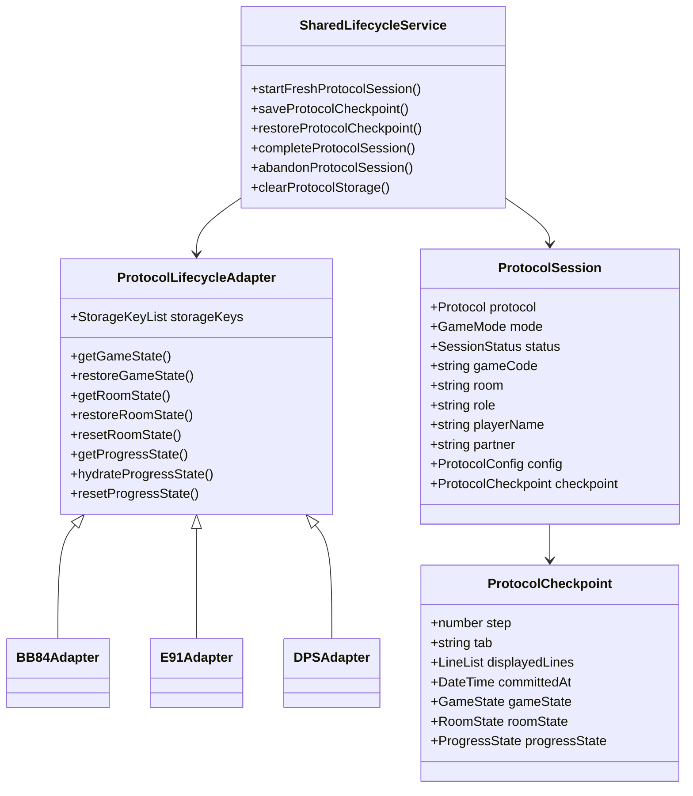
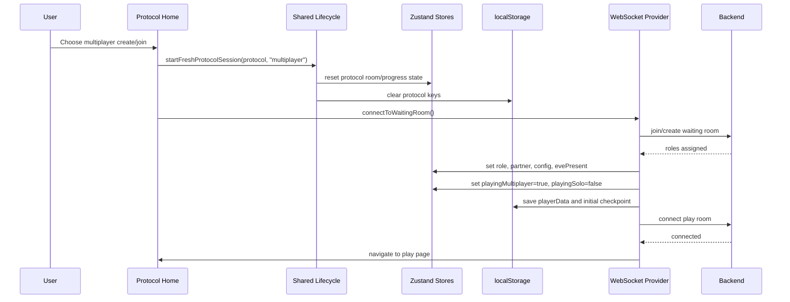
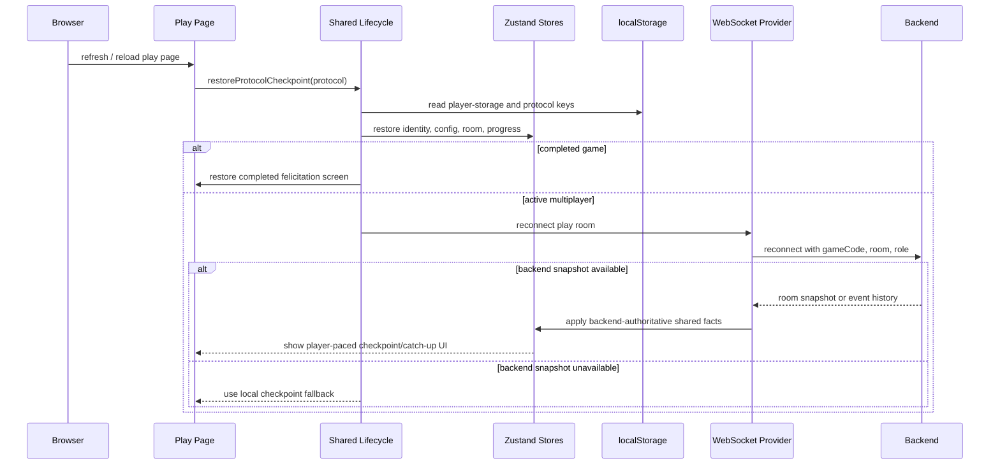
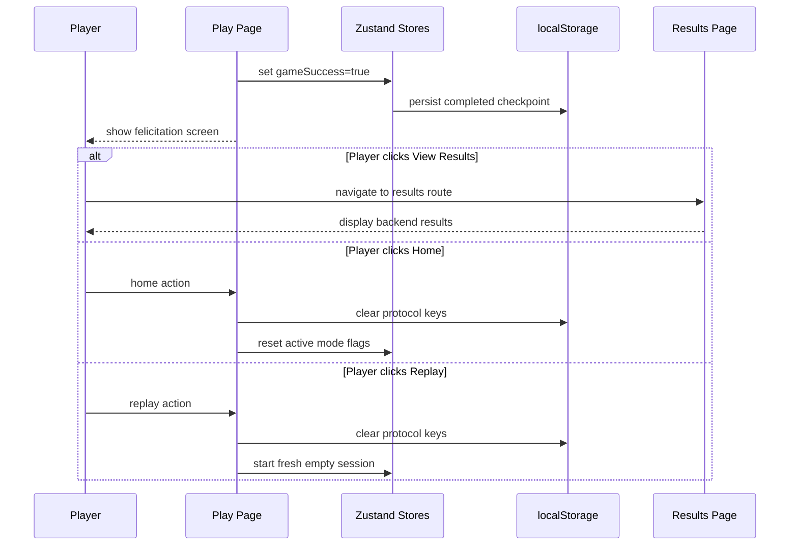

# Protocol Session Lifecycle Diagrams

> [!IMPORTANT]
> **Superseded.** The main architecture, adapter contract, and sequence
> diagrams are now in
> [shared-protocol-lifecycle-adr.md](shared-protocol-lifecycle-adr.md).
> This file is kept as historical context for the original preliminary thinking.

These diagrams describe the target architecture direction. They are not a claim
that the current code already implements every relationship exactly.

## Class Diagram

## Start Multiplayer Sequence

## Refresh / Reconnect Sequence

## Completed Game Sequence

