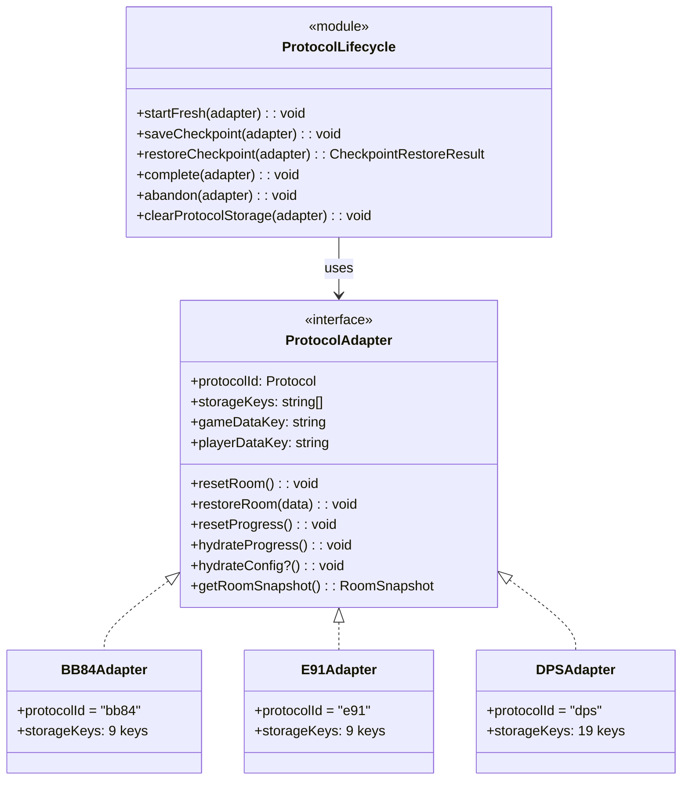
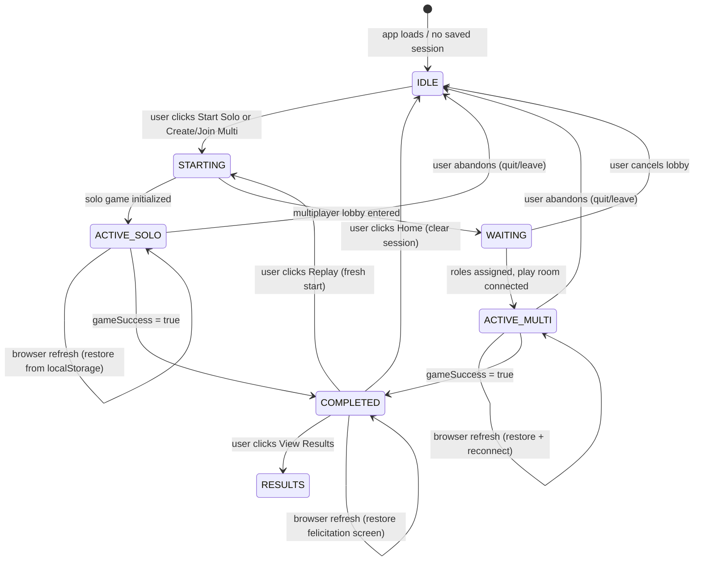
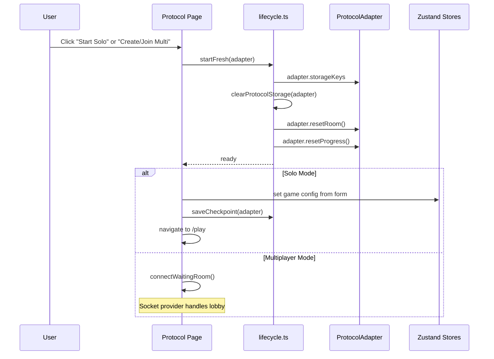
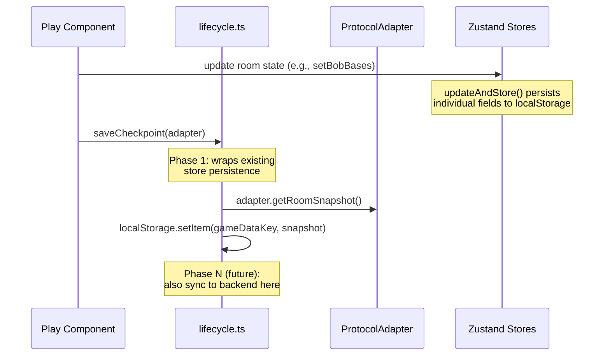
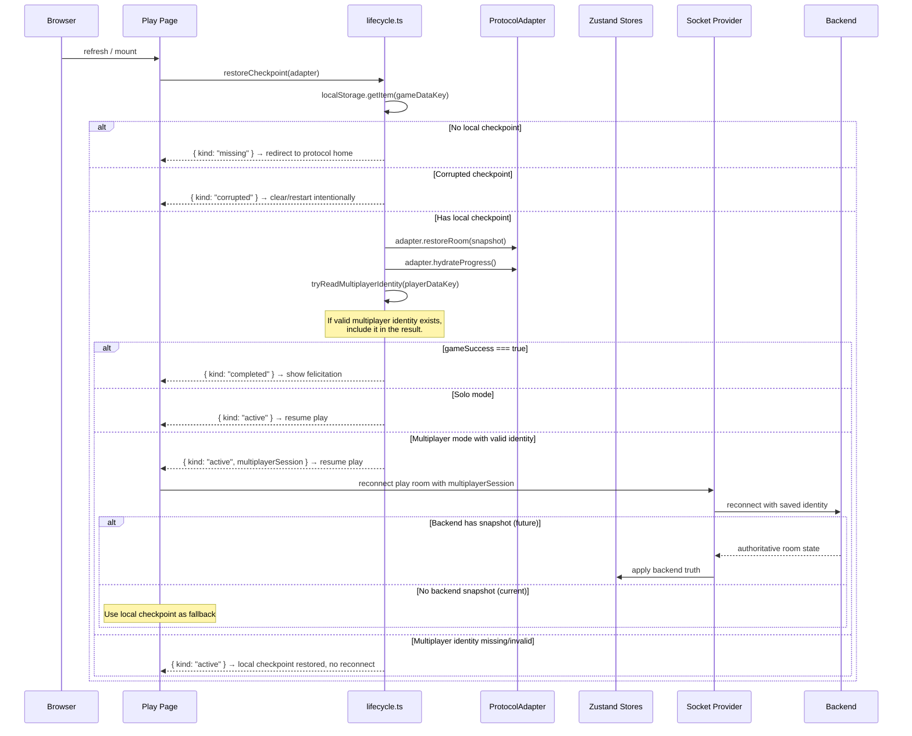
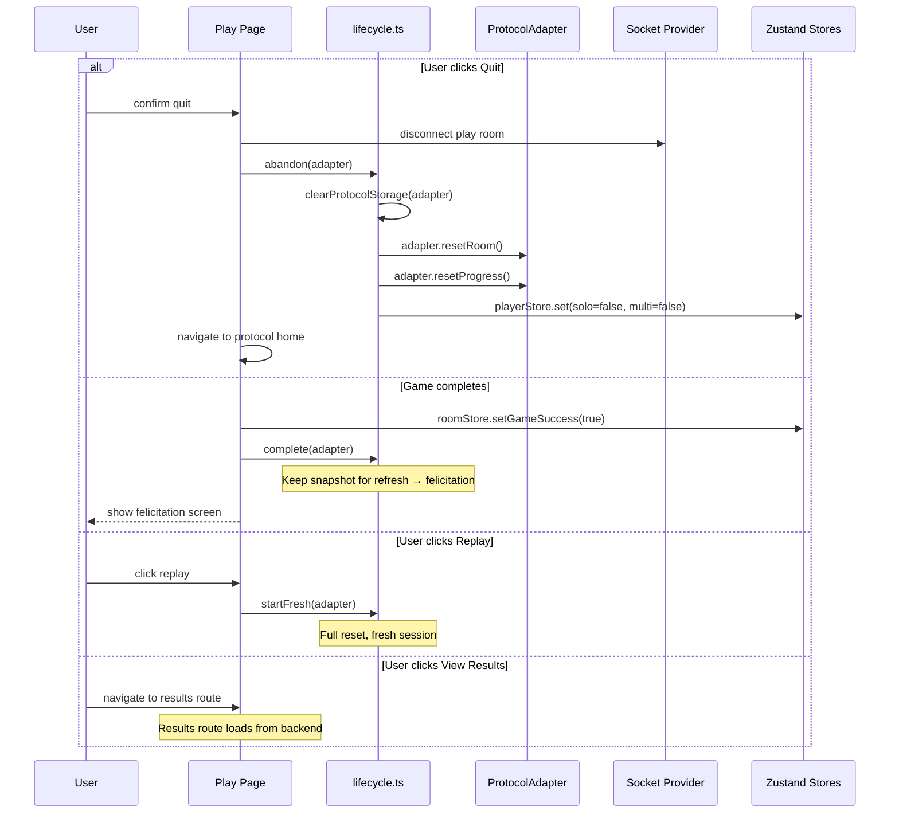
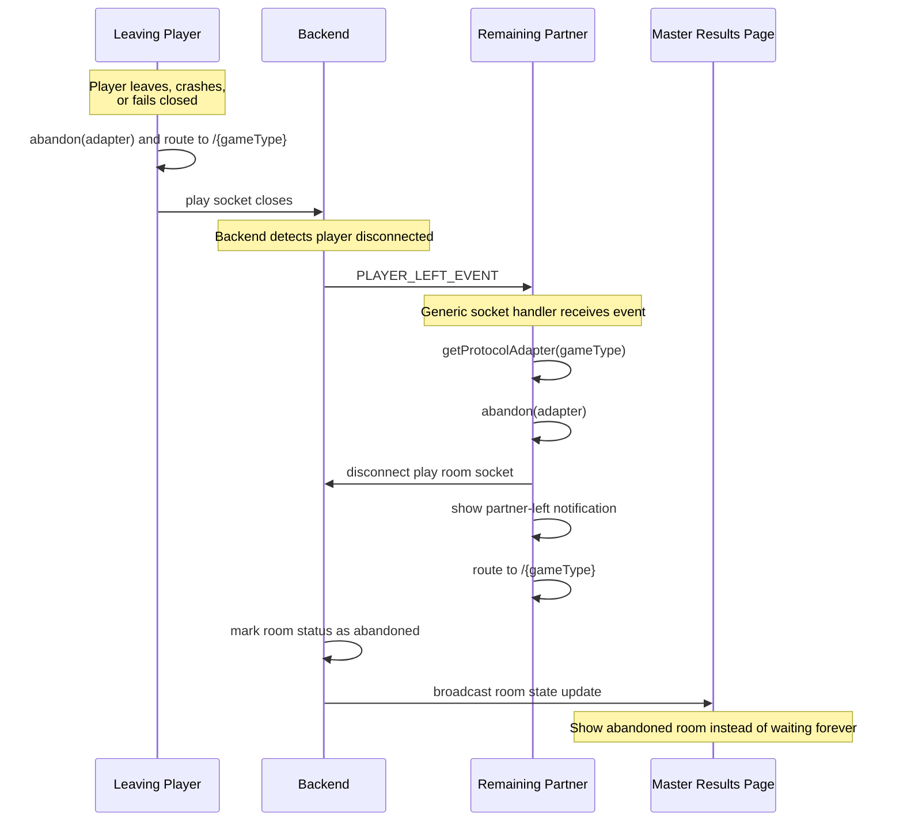

# Shared Protocol Lifecycle — Architecture Decision Record

> **Status**: DRAFT / REVIEW  
> **Date**: June 2026  
> **Supersedes**: [protocol-session-lifecycle-diagrams.md](protocol-session-lifecycle-diagrams.md) (preliminary version)  
> **Complements**: [storage-architecture.md](storage-architecture.md) (historical reasoning, per-protocol audit)

---

## 1. Problem Statement

### What works well

The app already has a clean 3-store split per protocol:

| Store | Purpose | Example |
|-------|---------|---------|
| `game-store` | Lobby config (game code, player count) | `bb84-game-store.ts` |
| `room-store` | Protocol-specific state (photons, bases, keys, phases) | `bb84-room-store.ts` |
| `progress-store` | UI checkpoint (step, tab, transcript lines) | `bb84-progress-store.ts` |

This separation is correct. Each protocol's room state is fundamentally different
(BB84 has bases/measurements, E91 has entanglement/CHSH, DPS has phases/wagons).
That is not a problem to solve.

Solo mode is localStorage-first and works reliably across all three protocols.

### What is duplicated

The **lifecycle operations** — starting, saving, restoring, leaving, replaying,
completing — are copy-pasted as ad-hoc code across protocols:

| Operation | BB84 | E91 | DPS |
|-----------|------|-----|-----|
| Clear storage | `clearBB84LocalStorage()` — 8 keys | `clearE91LocalStorage()` — 9 keys | `clearDPSStorageKeys()` — 19 keys |
| Restore session | Manual reads in `multi-game.tsx` + `hydrateBB84ProgressStore()` | Same but different timing | Same but different again |
| Role assignment | 30+ lines in socket-provider | 30+ different lines | 30+ more different lines |
| Disconnect waiting room | `disconnectBB84WaitingRoom()` | `disconnectE91WaitingRoom()` — identical | `disconnectDPSWaitingRoom()` — identical |

The socket-provider alone is **1,556 lines** with ~70 protocol-specific `if/else`
branches.

### Quantified redundancy

```
socket-provider.tsx: 1556 lines
  ├── ~25 occurrences of `if (gameType === 'bb84')`
  ├── ~25 occurrences of `if (gameType === 'e91')`
  ├── ~20 occurrences of `if (gameType === 'dps')`
  └── 3 identical disconnectXXXWaitingRoom() functions

Room stores: 3 files, ~640 lines total
  ├── 3× identical updateAndStore() helper
  ├── 3× identical isBrowser() helper
  ├── 3× identical resetRoom() / restoreGame() pattern

Progress stores: 3 files, ~430 lines total
  ├── 3× identical persistValue / readPersistedValue / removePersistedValue helpers
  ├── 3× identical hydrateFromStorage / resetProgress pattern

Game stores: 3 files, ~105 lines total
  └── 3× identical interface (only default values differ)

Utils: 3 files for clearXXXLocalStorage()
  └── 3× same pattern with different key lists
```

---

## 2. Decision

### Core principle

**Protocol data stays protocol-specific. Session lifecycle becomes shared.**

### Approach: TypeScript interfaces + adapter pattern + generic helper functions

This is a functional-style Strategy Pattern. No OOP classes, no class inheritance.

**Why not OOP classes?**
- Zustand stores are functions, not classes
- React components are functions
- Hooks are functions
- TypeScript interfaces + generics already provide the "contract" that OOP interfaces provide
- Classes would fight the framework

**What we use instead:**
- A `ProtocolAdapter` interface (the contract each protocol satisfies)
- Plain adapter objects per protocol (BB84, E91, DPS)
- Generic lifecycle functions that operate on any adapter

### Architecture overview

The UML below is a conceptual contract diagram. It does **not** mean the
implementation should use OOP classes; Phase 1 uses TypeScript interfaces, plain
adapter objects, and lifecycle functions.



> [!NOTE]
> `ProtocolEvents`, `ProtocolConstants`, and `SocketService` are **not** in Phase 1.
> They belong to the later socket-provider refactor (Phase 5). This keeps the initial
> adapter small and focused.

---

## 3. Lifecycle States

A protocol session can be in one of these states:



### Lifecycle rules

| Transition | What happens |
|-----------|-------------|
| **startFresh** | Clear protocol storage → reset room store → reset progress store → set mode flags |
| **saveCheckpoint** | Named entry point for persistence. Phase 1: stores already persist via `updateAndStore()`, this wraps that with a safe serializable snapshot. Future: backend sync plugs in here. |
| **restoreCheckpoint** | Public restore door for both solo and multiplayer. Restore local checkpoint from `gameDataKey` → hydrate progress → if valid multiplayer identity exists in `playerDataKey`, include it for reconnect. |
| **complete** | Keep snapshot in localStorage (so refresh restores felicitation). Do NOT auto-navigate to results. |
| **abandon** | Clear all protocol storage → reset stores → set `playingSolo=false`, `playingMultiplayer=false` |
| **partnerLeave** | Triggered by `PLAYER_LEFT_EVENT` from backend. Run `abandon(adapter)` → close play socket → route back to `/${gameType}` → show notification. |
| **clearProtocolStorage** | Remove all keys listed in `adapter.storageKeys` from localStorage |

### Why `saveCheckpoint()` is included

Stores already persist via `updateAndStore()`. So why have a separate `saveCheckpoint()`?

**Discoverability.** A future developer asks *"where does the app save state?"* The answer
should be: *"look at the lifecycle module, it has `saveCheckpoint()`."* Not: *"it's spread
across 20 different store methods in 3 different files."*

**Extensibility.** When backend snapshot sync arrives, `saveCheckpoint()` is the named
door where it plugs in. No hunting through stores.

**Consistency.** The lifecycle has start/restore/complete/abandon. It should have save.
A lifecycle without save is incomplete.

In Phase 1, `saveCheckpoint()` is a thin wrapper. It earns its place by being the
**one place** where persistence is findable and extensible.

Important boundary: `saveCheckpoint()` should not blindly persist transient
Zustand internals. If a store ever contains non-serializable fields or actions,
the adapter must expose an explicit serializable room snapshot.

### Restore checkpoint vs multiplayer identity

`restoreCheckpoint(adapter)` is the simple public API. A future developer should
be able to call it and read the result as: "restore the last saved protocol
context."

Internally, restore has two different concerns:

1. **Local checkpoint** — protocol room snapshot and UI progress. This applies to
   solo and multiplayer.
2. **Multiplayer session identity** — `gameCode`, `role`, and `room`. This is
   only needed so multiplayer can reconnect to the backend.

The public function stays simple, but the result is explicit:

```typescript
type CheckpointRestoreResult =
    | {kind: 'missing'}
    | {kind: 'corrupted'}
    | {kind: 'active'; multiplayerSession?: MultiplayerSession; multiplayerSessionIssue?: MultiplayerSessionIssue}
    | {kind: 'completed'; multiplayerSession?: MultiplayerSession; multiplayerSessionIssue?: MultiplayerSessionIssue};
```

If multiplayer identity is missing or invalid, the checkpoint can still be
restored locally. The page/socket layer simply cannot reconnect until it has a
valid multiplayer session.

### Internal restore components

| Element | Visibility | Responsibility |
|---------|------------|----------------|
| `restoreCheckpoint(adapter)` | Public lifecycle API | Restore the saved protocol context and return the next state for the page. |
| `readStoredObject(gameDataKey)` | Internal helper | Read and validate the local room checkpoint. |
| `adapter.restoreRoom(snapshot)` | Adapter method | Put protocol-specific room data back into the right store. |
| `adapter.hydrateProgress()` | Adapter method | Restore UI progress from the protocol store. |
| `restoreMultiplayerSession(adapter)` | Internal helper | Read `playerDataKey`, validate `gameCode`, `role`, and `room`, then return `multiplayerSession` if reconnect is possible. |
| Play page / socket layer | Caller after restore | Reconnect to the backend only when `restoreCheckpoint()` returns `multiplayerSession`. |

So reconnect is part of the restore architecture, but not a separate public
lifecycle command. The page asks to restore; the lifecycle tells it whether
there is enough multiplayer identity to reconnect.

---

## 4. Sequence Diagrams

### 4.1 Start Fresh Session



### 4.2 Save Checkpoint



### 4.3 Refresh / Restore



### 4.4 Leave / Complete / Replay



### 4.5 Partner Left / Room Abandoned (Multiplayer Only)

This flow handles a player leaving, crashing, or failing closed during a multiplayer game.
The frontend unblocks the partner locally; the backend owns room status and Master/results updates.



---

## 5. Adapter Contract (Phase 1)

### Interface

```typescript
// lib/protocol-lifecycle/types.ts

type Protocol = 'bb84' | 'e91' | 'dps';
type RoomSnapshot = Record<string, unknown>;
type MultiplayerSessionIssue = 'invalid' | 'corrupted';

interface MultiplayerSession {
    gameCode: string;
    role: string;
    room: string;
    playerName?: string;
    partner?: string;
}

type CheckpointRestoreResult =
    | {kind: 'missing'}
    | {kind: 'corrupted'}
    | {kind: 'active'; multiplayerSession?: MultiplayerSession; multiplayerSessionIssue?: MultiplayerSessionIssue}
    | {kind: 'completed'; multiplayerSession?: MultiplayerSession; multiplayerSessionIssue?: MultiplayerSessionIssue};

interface ProtocolAdapter {
    /** Protocol identifier */
    protocolId: Protocol;

    /** ALL localStorage keys owned by this protocol */
    storageKeys: readonly string[];

    /** Key for the full room state snapshot (e.g., 'bb84GameData') */
    gameDataKey: string;

    /** Key for multiplayer identity/session data (e.g., 'bb84PlayerData') */
    playerDataKey: string;

    /** Reset room store to initial state */
    resetRoom(): void;

    /** Restore room store from a parsed localStorage snapshot */
    restoreRoom(data: RoomSnapshot): void;

    /** Reset progress store to initial state */
    resetProgress(): void;

    /** Hydrate progress store from localStorage */
    hydrateProgress(): void;

    /** Hydrate setup/config store values persisted outside gameDataKey */
    hydrateConfig?(): void;

    /** Return JSON-safe room data for persistence */
    getRoomSnapshot(): RoomSnapshot;
}
```

Implement `hydrateConfig()` only when a protocol stores setup values outside
`gameDataKey`, such as photon count, Eve flag, or validation-bit length.

### Example adapter (BB84)

```typescript
// lib/protocol-lifecycle/bb84-adapter.ts

import useBB84RoomStore, {type BB84RoomStateSchema} from '@/store/bb84/bb84-room-store';
import useBB84GameStore from '@/store/bb84/bb84-game-store';
import {
    useBB84ProgressStore,
    hydrateBB84ProgressStore,
} from '@/store/bb84/bb84-progress-store';
import {toSerializableSnapshot} from './snapshot';
import type {ProtocolAdapter, RoomSnapshot} from './types';

const readConfigValue = (key: string): unknown => {
    if (typeof window === 'undefined') return undefined;
    const raw = localStorage.getItem(key);
    if (raw === null) return undefined;

    try {
        return JSON.parse(raw);
    } catch {
        return undefined;
    }
};

export const bb84Adapter: ProtocolAdapter = {
    protocolId: 'bb84',
    gameDataKey: 'bb84GameData',
    playerDataKey: 'bb84PlayerData',
    storageKeys: [
        'bb84PlayerData',
        'bb84PhotonNumber',
        'bb84Step',
        'bb84Tab',
        'bb84GameData',
        'bb84DisplayedLines',
        'bb84ValidationBitsLength',
        'bb84GameHasEve',
        'bb84BobBasisInputs',
    ],
    resetRoom: () => useBB84RoomStore.getState().resetRoom(),
    restoreRoom: (data) => useBB84RoomStore.getState().restoreGame(data as Partial<BB84RoomStateSchema>),
    resetProgress: () => useBB84ProgressStore.getState().resetProgress(),
    hydrateProgress: () => hydrateBB84ProgressStore(),
    hydrateConfig: () => {
        const gameStore = useBB84GameStore.getState();
        const photonNumber = readConfigValue('bb84PhotonNumber');
        const gameHasEve = readConfigValue('bb84GameHasEve');
        const validationBitsLength = readConfigValue('bb84ValidationBitsLength');

        if (typeof photonNumber === 'number') gameStore.setPhotonNumber(photonNumber);
        if (typeof gameHasEve === 'boolean') gameStore.setGameHasEve(gameHasEve);
        if (typeof validationBitsLength === 'number') {
            gameStore.setValidationBitsLength(validationBitsLength);
        }
    },
    getRoomSnapshot: () => toSerializableSnapshot(
        useBB84RoomStore.getState() as unknown as RoomSnapshot,
    ),
};
```

### Lifecycle module

```typescript
// lib/protocol-lifecycle/lifecycle.ts

import usePlayerStore from '@/store/player-store';

function resetPlayerModeFlags(): void {
    const playerStore = usePlayerStore.getState();
    playerStore.setPlayingSolo(false);
    playerStore.setPlayingMultiplayer(false);
}

export function clearProtocolStorage(adapter: ProtocolAdapter): void {
    if (typeof window === 'undefined') return;
    adapter.storageKeys.forEach((key) => localStorage.removeItem(key));
}

export function startFresh(adapter: ProtocolAdapter): void {
    clearProtocolStorage(adapter);
    adapter.resetRoom();
    adapter.resetProgress();
    resetPlayerModeFlags();
}

export function saveCheckpoint(adapter: ProtocolAdapter): void {
    if (typeof window === 'undefined') return;

    // Phase 1: stores already persist field-by-field via updateAndStore().
    // This function provides a named lifecycle entry point.
    // Future (Phase N): this is where backend snapshot sync plugs in.
    localStorage.setItem(adapter.gameDataKey, JSON.stringify(adapter.getRoomSnapshot()));
}

export function restoreCheckpoint(
    adapter: ProtocolAdapter
): CheckpointRestoreResult {
    const gameData = readStoredObject(adapter.gameDataKey);
    if (gameData.kind === 'missing') return {kind: 'missing'};
    if (gameData.kind === 'corrupted') return {kind: 'corrupted'};

    adapter.restoreRoom(gameData.data);
    adapter.hydrateProgress();
    adapter.hydrateConfig?.();

    const kind = adapter.getRoomSnapshot().gameSuccess === true ? 'completed' : 'active';
    const session = restoreMultiplayerSessionIfValid(adapter);

    if (session) {
        return {kind, multiplayerSession: session};
    }

    return {kind};
}

export function complete(adapter: ProtocolAdapter): void {
    // Keep the snapshot in localStorage so refresh restores felicitation.
    // Do NOT clear storage here. Clearing belongs to Home / Replay / startFresh.
    saveCheckpoint(adapter);
}

export function abandon(adapter: ProtocolAdapter): void {
    clearProtocolStorage(adapter);
    adapter.resetRoom();
    adapter.resetProgress();
    resetPlayerModeFlags();
}
```

### Registry

```typescript
// lib/protocol-lifecycle/registry.ts

import { bb84Adapter } from './bb84-adapter';
import { e91Adapter } from './e91-adapter';
import { dpsAdapter } from './dps-adapter';

export const protocolAdapters = {
    bb84: bb84Adapter,
    e91: e91Adapter,
    dps: dpsAdapter,
} as const;

export function getAdapter(protocolId: Protocol): ProtocolAdapter {
    const adapter = protocolAdapters[protocolId];
    if (!adapter) throw new Error(`Unknown protocol: ${protocolId}`);
    return adapter;
}
```

---

## 6. File Structure

### New files (Phase 1)

```
shared/
└── protocol-lifecycle/
    ├── types.ts              # ProtocolAdapter, ProtocolId, CheckpointRestoreResult
    ├── lifecycle.ts           # startFresh, saveCheckpoint, restoreCheckpoint, complete, abandon, clearProtocolStorage
    ├── bb84-adapter.ts        # BB84 adapter object
    ├── e91-adapter.ts         # E91 adapter object
    ├── dps-adapter.ts         # DPS adapter object
    └── registry.ts            # Adapter lookup by protocol ID
```

### Unchanged files

```
store/                         # ALL existing stores stay exactly as they are
├── player-store.ts
├── bb84/
│   ├── bb84-game-store.ts
│   ├── bb84-room-store.ts
│   └── bb84-progress-store.ts
├── e91/
│   ├── e91-game-store.ts
│   ├── e91-room-store.ts
│   └── e91-progress-store.ts
└── dps/
    ├── dps-game-store.ts
    ├── dps-room-store.ts
    └── dps-progress-store.ts
```

### Future files (Phase 5 — socket provider refactor, NOT now)

```
components/providers/
├── socket-provider.tsx              # Refactored: shared connection logic
└── socket-handlers/
    ├── waiting-room-handler.ts      # Shared lobby events
    ├── bb84-play-handler.ts         # BB84-specific play room events
    ├── e91-play-handler.ts          # E91-specific play room events
    └── dps-play-handler.ts          # DPS-specific play room events
```

---

## 7. How to Add a Future Protocol (e.g., B92)

With this architecture, adding B92 requires:

### Step 1: Create protocol stores (protocol-specific)

```
store/b92/
├── b92-game-store.ts       # Copy bb84-game-store, change defaults
├── b92-room-store.ts       # Define B92 protocol state shape
└── b92-progress-store.ts   # Copy bb84-progress-store, change key prefixes
```

### Step 2: Create adapter (~25 lines)

```typescript
// lib/protocol-lifecycle/b92-adapter.ts

import useB92RoomStore from '@/store/b92/b92-room-store';
import { useB92ProgressStore, hydrateB92ProgressStore } from '@/store/b92/b92-progress-store';
import {toSerializableSnapshot} from './snapshot';
import type {RoomSnapshot} from './types';

export const b92Adapter: ProtocolAdapter = {
    protocolId: 'b92',  // add 'b92' to Protocol type first
    gameDataKey: 'b92GameData',
    playerDataKey: 'b92PlayerData',
    storageKeys: [
        'b92PlayerData', 'b92PhotonNumber', 'b92Step', 'b92Tab',
        'b92GameData', 'b92DisplayedLines', 'b92GameHasEve',
    ],
    resetRoom: () => useB92RoomStore.getState().resetRoom(),
    restoreRoom: (data) => useB92RoomStore.getState().restoreGame(data),
    resetProgress: () => useB92ProgressStore.getState().resetProgress(),
    hydrateProgress: () => hydrateB92ProgressStore(),
    getRoomSnapshot: () => toSerializableSnapshot(
        useB92RoomStore.getState() as unknown as RoomSnapshot,
    ),
};
```

### Step 3: Register

```typescript
// lib/protocol-lifecycle/registry.ts — add one line:
import { b92Adapter } from './b92-adapter';
// ... add to protocolAdapters object
```

### Step 4: Create protocol logic

```
lib/b92/
├── solo-player.ts    # B92 quantum simulation functions
└── utils.ts          # B92 constants file
```

### Step 5: Create socket handler (Phase 5+ only)

```
components/providers/socket-handlers/
└── b92-play-handler.ts   # B92-specific WebSocket play events
```

### Step 6: Create UI

```
components/b92/
├── home-page/         # Solo modal, game form, lobby
├── play-page/         # Solo game, multi game, tabs
├── results-page/      # Results display
└── waiting-room-page/ # Waiting room UI

app/(main)/b92/
├── page.tsx           # B92 protocol home
├── play/page.tsx      # B92 play page
└── results/page.tsx   # B92 results page
```

### What you do NOT touch

- ❌ `lifecycle.ts` — it works with any adapter
- ❌ Other protocol adapters or stores
- ❌ The lifecycle interface

---

## 8. Implementation Phases

> [!IMPORTANT]
> Incremental. Reversible. Each phase must compile and pass manual testing before
> the next phase begins.

### Phase 0: Architecture document ✅

- Write this ADR ← **you are here**
- Agree on adapter contract
- Agree on lifecycle API

### Phase 1: Create shared infrastructure (no behavior change yet)

**Create:**
- `lib/protocol-lifecycle/types.ts`
- `lib/protocol-lifecycle/lifecycle.ts`
- `lib/protocol-lifecycle/bb84-adapter.ts`
- `lib/protocol-lifecycle/e91-adapter.ts`
- `lib/protocol-lifecycle/dps-adapter.ts`
- `lib/protocol-lifecycle/registry.ts`

**Checkpoint:** All files compile. Existing app behavior unchanged. Adapters
correctly reference existing stores.

### Phase 2: Pilot BB84

**Replace in BB84 code:**
- `clearBB84LocalStorage()` → `clearProtocolStorage(bb84Adapter)`
- Manual restore in `multi-game.tsx` → `restoreCheckpoint(bb84Adapter)`
- Inline start logic → `startFresh(bb84Adapter)`

**Test:**
- Solo: start → play → refresh → resume → complete → replay → home
- Multi: create → join → play → refresh → resume → complete → results
- Leave during solo. Leave during multi.
- Start BB84 solo, then start E91 solo — BB84 data should be independent

**Checkpoint:** BB84 behavior identical to before. `clearBB84LocalStorage()` can
be deleted.

**Stop/adjust gate:** If BB84 becomes buggier, stop and fix the adapter before
touching E91.

### Phase 3: Migrate E91

Same replacements as Phase 2, but for E91. E91 is the stress test because it has
the most complex room state (entanglement classification, CHSH preferences, dice,
multiple bit arrays).

**Checkpoint:** E91 behavior identical to before. `clearE91LocalStorage()` can be
deleted.

### Phase 4: Migrate DPS

Same pattern. DPS has the most localStorage keys (19).

**Checkpoint:** DPS behavior identical. `clearDPSStorageKeys()` can be deleted.

### Phase 5: Refactor socket-provider (LAST)

> [!WARNING]
> This is the riskiest phase. The socket-provider is the heart of multiplayer.
> Do this only after Phases 2–4 are stable and committed.

**Extract:**
- 3 identical `disconnectXXXWaitingRoom()` → 1 generic `disconnectWaitingRoom(adapter)`
- 3 similar `connectToWaitingRoom()` branches → 1 generic function
- 3 similar `startGame()` branches → 1 generic function
- `PLAYER_LEFT_EVENT` → lookup `getProtocolAdapter(gameType)`, run `abandon(adapter)`, then route to `/${gameType}`
- Protocol-specific `onmessage` handlers → separate files per protocol

**What stays in socket-provider:**
- Connection state management (`isWaitingRoomConnected`, `isPlayRoomConnected`)
- Socket lifecycle (open/close/error)
- The dispatch to protocol-specific handlers

**Test:** Full multiplayer flows for all 3 protocols.

### Phase 6: Clean up

- Remove dead `clearXXXLocalStorage()` functions from `lib/*/utils.ts`
- Remove duplicated `isBrowser()` definitions (use one from lifecycle)
- Update this ADR with post-implementation notes
- Rewrite `storage-architecture.md` to describe only the final architecture (as
  that document itself requests)

---

## 9. What NOT to Do

> [!CAUTION]
> These are architectural traps. Each has been discussed and rejected.

### ❌ Don't merge room stores into one generic store

Each protocol has fundamentally different state. BB84 has photons/bases/measurements.
E91 has entanglement types, CHSH preferences, dice. DPS has phases, wagons, time
slots. A generic store would be `Record<string, any>` — worse than what we have.

### ❌ Don't use class inheritance

`class BB84Store extends BaseProtocolStore` fights React, fights Zustand, adds
complexity for no gain in this ecosystem.

### ❌ Don't make one "universal" socket handler

Play-room events are inherently different per protocol. The shared parts are
connection/lifecycle. The message dispatch stays protocol-specific.

### ❌ Don't over-abstract progress or game stores yet

The 3 progress stores are ~95% identical. The 3 game stores are ~99% identical.
But abstracting them adds parameterization complexity that is not worth it for 3
files of 35–145 lines each. Revisit only if a 4th protocol arrives.

### ❌ Don't touch existing stores

The adapter wraps existing stores. It does not modify them. `bb84-room-store.ts`
keeps its `updateAndStore()`, `resetRoom()`, `restoreGame()` exactly as they are.

### ❌ Don't create `StorageService`, `SocketService`, `ProtocolEvents`, `ProtocolConstants` in Phase 1

These concepts are valid for the north-star architecture but add unnecessary
ceremony before the core adapter pattern is proven. Introduce them in Phase 5 if
needed, not before.

### ❌ Don't refactor socket-provider before Phases 2–4 are stable

The socket-provider is the riskiest file. Touch it last, when the lifecycle
adapters are already working and committed.

---

## 10. Source of Truth Rules

These rules apply to the current app and the refactored architecture:

### Solo mode
- Source of truth: `localStorage`
- Restore from: `localStorage`
- Clear by: `clearProtocolStorage(adapter)`

### Multiplayer mode
- Source of truth for shared protocol facts: backend room + WebSocket
- Recovery cache: `localStorage`
- Restore UI first from the local checkpoint, then reconnect if valid multiplayer identity exists
- Reconcile shared protocol facts from backend room snapshot (future) or local snapshot (current fallback)
- UI pacing: compare backend state with local checkpoint, guide missed steps in order
- If backend reconnect fails, the restored local checkpoint can support retry / exit / explicit solo-style continuation later
- Clear by: `clearProtocolStorage(adapter)` after completion or explicit exit

### Practical test for future work

When changing any protocol, ask:

1. Where is the authoritative state saved?
2. How is it restored after refresh?
3. How is stale state cleared after completion or exit?
4. (Multiplayer) If the backend is ahead after reconnect, how does the UI teach
   the missed steps instead of skipping them?

If the answers differ between BB84, E91, and DPS, the implementation is drifting.

---

## 11. Session Detection and Route Guards

> **Added**: July 2026 — tracked as **Task 48** in [tasks_todo.md](../tasks_todo.md).
> This section extends §10 from *data* source-of-truth to *route-access* source-of-truth.
> It is add-only and does not revise earlier sections, but where noted it **supersedes**
> the mode-flag mechanism (`resetPlayerModeFlags`) as the authority for mode.

### Why this section exists

Today, "Am I in a valid session, and is it solo or multiplayer?" is answered by **four
readers with different logic** — `components/hoc/is-connected.tsx`, the play page's
`playingSolo ? SoloGame : MultiGame` switch, the form's `detectBB84Session()`, and
`multi-game.tsx`'s own restore check — over state written by **scattered writers**
(socket-provider side-effects, modals, the form). When two readers disagree, a gap opens
(e.g. the phantom empty game after Back→Forward at félicitation). The fix is **one resolver
that every guard reads**.

### Rules

1. **One resolver.** A single `detectSession(adapter)` answers all three questions:
   *can this route render?*, *solo or multiplayer?*, *reconnect or not?* Guards and pages
   read it; none re-derives session truth independently.

2. **Play routes require a valid persisted session.** `/${protocol}/play` may render only
   when `detectSession` reports a valid session. No valid session → fail-close, redirect to
   `/${protocol}` (already the intent of §4.3's `{kind:'missing'} → redirect to protocol home`).

3. **A live play socket is NOT route authorization.** For *route access*, validity comes from
   the persisted checkpoint/identity, never from `isPlayRoomConnected`. This is **narrower**
   than §10's "backend room + WebSocket is the source of truth for shared protocol *facts*",
   which remains true for reconciling in-game state during active play — access ≠ fact
   reconciliation. Rationale (verified): the session is persisted *before* play navigation —
   socket-provider `ROLES_EVENT` writes `${protocol}PlayerData` and the mode flag, then calls
   `connectToPlayRoom`, then the play socket's `CONNECTED_EVENT` navigates — so the socket
   term in the guard was only ever race-cover.

4. **Waiting-room routes are different (guards must be path-aware).** The lobby has no full
   play session yet and is socket-driven, so a waiting-room guard MAY use
   `isWaitingRoomConnected` as an access signal. The play-route rule (require a persisted
   session) must therefore **not** be applied blanket to waiting-room routes. `is-connected.tsx`
   is shared by both today; splitting it or making it path-aware is part of the work.

5. **Mode is derived from the session, not the flags.** Solo-vs-multiplayer comes from
   `detectSession`, not from the drifting `playingSolo`/`playingMultiplayer` booleans. This
   **supersedes** those booleans as the mode authority (`resetPlayerModeFlags()` shrinks to
   cleanup, not truth). The play page's `playingSolo ? Solo : Multi` switch is replaced by
   session-derived mode.

6. **The resolver must be BB84-first and protocol-careful.** Session shape is NOT uniform:
   DPS solo persists `dpsPlayerData` (with a `playingSolo` marker), while BB84/E91 solo persist
   **no** `*PlayerData` at all. So "player-data key exists ⇒ multiplayer" is **false** for DPS.
   The resolver must key multiplayer off a valid multiplayer identity (`role` + `room`), not
   the mere presence of the player-data key. Build and prove it on BB84 first; generalize to
   E91/DPS only after.

### Migration compatibility vs target architecture

**Principle: an existing difference between protocols is NOT automatically an architecture
difference.** Keep a per-protocol difference only when the protocol itself requires it.
Otherwise it is implementation drift, and the target is one standard, unified shape. We must
not stop unifying because of old code that can be refactored — only because a real protocol
need demands divergence.

Applied to session storage, the **target standard**:
- `playerDataKey` / `*PlayerData` means **multiplayer identity only** (`role`, `room`,
  `gameCode`, `partner`, …). Candidate rename at cleanup: `multiplayerSessionKey`.
- **Solo** session state is represented by the shared checkpoint model (the `gameDataKey`
  checkpoint; mode derived from "no valid multiplayer identity") — NOT by writing a
  `*PlayerData` that pretends to be multiplayer player data.
- Mode is explicit / consistently derived, never guessed from incidental legacy keys.

**Known drift to standardize (not freeze): DPS solo writes `dpsPlayerData`
`{playingSolo:true, role, gameCode}` (no `room`)**, while BB84/E91 solo write no player data.
This is almost certainly old drift, not a DPS-specific need.
- **Short term (Slice B):** `detectSession` MUST tolerate the DPS solo shape — a *parseable*
  `playerData` **explicitly marked `playingSolo: true` with no `room`** is **solo**, even with no
  `gameData` checkpoint. This branch is **gated to `adapter.protocolId === 'dps'`** so the drift
  stays a DPS-specific compat rule and never becomes a cross-protocol one. (For BB84/E91, and for
  any parseable `playerData` that is neither this DPS marker nor a valid multi identity, the result
  is **corrupt/none**, NOT solo — so broken multiplayer never silently degrades to SoloGame.) This
  is **migration compatibility**, not the target.
- **At DPS migration:** rewrite DPS solo to the standard (no `dpsPlayerData` in solo) unless a
  real DPS-specific reason surfaces.

Target session shape that protocols and guards converge on:

```typescript
type ProtocolSession =
  | { mode: 'solo';  protocol: ProtocolId; completed: boolean }
  | { mode: 'multi'; protocol: ProtocolId; completed: boolean; session: MultiplayerSession };
```

### Implementation

Staged in Task 48 (Slices A–E), reproduce-first, no big-bang. Slice A is a read-only spike;
the socket-de-authorization (Slice E) applies to **play routes only**, leaving the
waiting-room guard separate.

The interim detector used by guards (Slice B) is the read-only, non-hydrating classifier:

```typescript
type DetectedSession =
  | { kind: 'none' }
  | { kind: 'corrupt' }
  | { kind: 'solo';  completed: boolean }
  | { kind: 'multi'; completed: boolean; session: MultiplayerSession };
```

It converges toward `ProtocolSession` above; `completed` is an attribute, not a separate mode.

---

## 12. Relationship to Existing Documents

| Document | Status | Action |
|----------|--------|--------|
| **This ADR** | **Draft definitive plan** | Candidate architecture reference during review |
| [storage-architecture.md](storage-architecture.md) | Historical reasoning | Add header note pointing here. Keep for context. Rewrite after Phase 6. |
| [protocol-session-lifecycle-diagrams.md](protocol-session-lifecycle-diagrams.md) | Superseded | Add header note pointing here. The ADR has better diagrams. |
| [product-vision-game-experience.md](product-vision-game-experience.md) | Separate concern | Unchanged. Product/UX vision, not architecture. |
| [tasks_todo.md](../tasks_todo.md) Task 26 | Architecture task | Update to reference this ADR. |
